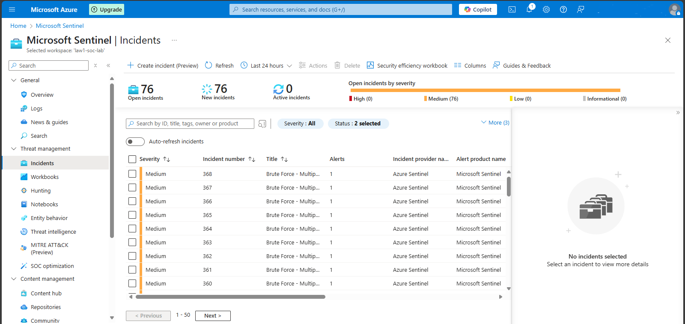

#🛡️ Azure Sentinel Honeypot Lab (SIEM Detection Project)

This project demonstrates a self-built cloud honeypot using a publicly exposed Azure VM and Microsoft Sentinel to detect brute-force login attempts from real-world threat actors.

---

##💡 Project Summary

I built a cloud-based detection lab on Azure to simulate unauthorized access attempts and observe brute-force activity. Logs were ingested into Microsoft Sentinel for monitoring, detection, and manual incident investigation.

---

## ✅ What I Did

- Created an Azure **Resource Group**, **VNet**, and **Windows 10 VM**
- Configured **NSG** to allow all inbound traffic and disabled **Windows Firewall**
- Simulated failed RDP logins.Verified **Event ID 4625** in Event Viewer
- Connected the VM to a **Log Analytics Workspace**
- Installed and configured **Microsoft Sentinel**
- Used **KQL** to identify failed login attempts from attacker IPs
- Imported a **GeoIP watchlist** to enrich attacker data
- Created a **Sentinel Workbook** to visualize global attack locations
- Built a custom **Analytics Rule** to detect brute-force login patterns
- Investigated Sentinel-generated incidents via the **Investigation Graph**
- Validated attacker IPs using **VirusTotal** and manually closed **True Positive** incidents
- Blocked the confirmed malicious IP** using an **NSG deny rule** and verified it with **IP Flow Verify** in **Network Watcher**

---

## 📸 Screenshots 

🔓 0. VM Firewall Disabled (Inside the VM)
   

🔠View Full Lab Walkthrough (Screenshots)

   

🔓 1. NSG Rule - Exposing VM to Inbound Traffic
    
    
📊 2. KQL Query to Detect Failed Logins + GeoIP Lookup
    

🌍 3. Global Attack Map - Brute Force Sources
   

🚨 4.Logic App Automation Flow (Incident Trigger → Email)
    .png)

🔧 5.Incident Email Alert (From Logic App)
   

🧠 6.Sentinel Generating Multiple Brute Force Incidents
   

🕵️‍♂️ 7. Sentinel Incident Graph - Attack Entity Mapping
    

🌐 8. Attacker Entity Investigation (IP Profile in Sentinel)
    

🧪 9. Verifying Attacker IP via VirusTotal
   

✅ 10. Confirmed True Positive + Closed Incident
   

🚫 11. Manual NSG Rule to Block Malicious IP  
   

🧪 12. IP Flow Verification – Deny Rule Working  
   

   

---

## 🛠️ Tools & Technologies

- Microsoft Azure (Resource Group,VNet,VM,NSG)
- Microsoft Sentinel (SIEM)
- Log Analytics Workspace (LAW)
- Azure Monitor Agent (AMA)
- Kusto Query Language (KQL)
- Sentinel Analytics Rules & Workbooks
- VirusTotal
- RDP & Event Viewer

---

## 🧠 Insights & Lessons Learned

- Exposing the VM to the internet allowed me to simulate real-world attacks and observe how attackers behave in a short timeframe.
- Disabling the VM firewall and creating open NSG rules were intentional misconfigurations to attract brute-force attempts, which were successfully logged and analyzed.
- I used Microsoft Sentinel’s built-in analytics rules to detect and alert on suspicious activity, following the full incident lifecycle: detection, investigation, validation, and closure.
- Validating attacker IPs using **VirusTotal** added strong confidence in marking incidents as true positives.
- I manually blocked the confirmed malicious IP using a **Network Security Group (NSG) deny rule**, and verified it was working using **Azure Network Watcher - IP Flow Verify**.
- This project helped me gain hands-on experience with how cloud SIEM systems like Microsoft Sentinel operate — from monitoring and detection to response and hardening the environment post-incident.

---

## 📄 License

All content in this repository-including screenshots, documentation, and detection logic was created by me, Rakip L.

See the [LICENSE](LICENSE) file for more details.

---

## 🙋‍♂️ Rakip
 
Cyber Security | AZ-900 Certified   
  
<!--📫 [LinkedIn] | [GitHub] -->
