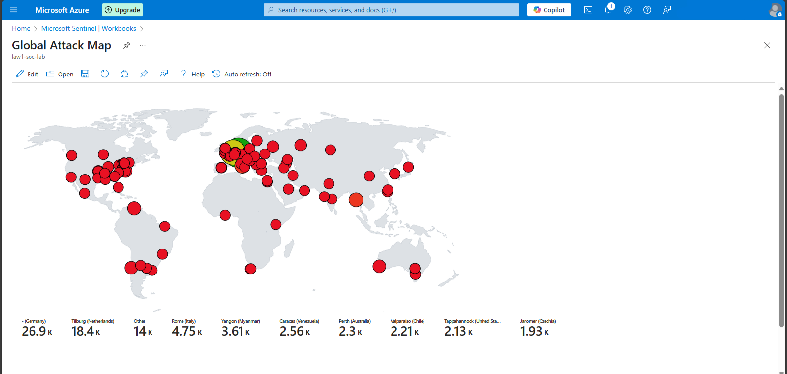
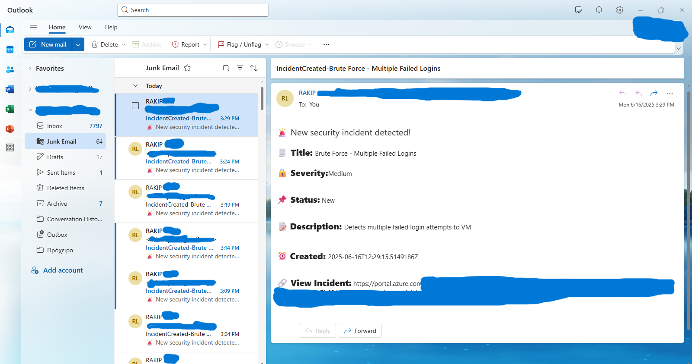

#🛡️ Azure Sentinel Honeypot Lab (SIEM Detection Project)

This project demonstrates a self-built cloud honeypot using a publicly exposed Azure VM and Microsoft Sentinel to detect brute-force login attempts from real-world threat actors.

---

##💡 Project Summary

I built a cloud-based detection lab on Azure to simulate unauthorized access attempts and observe brute-force activity. Logs were ingested into Microsoft Sentinel for monitoring, detection, and manual incident investigation.

---

## ✅ What I Did

- Created an Azure **Resource Group**, **VNet**, and **Windows 10 VM**
- Configured **NSG** to allow all inbound traffic and disabled **Windows Firewall**
- Simulated failed RDP logins.Verified **Event ID 4625** in Event Viewer
- Connected the VM to a **Log Analytics Workspace**
- Installed and configured **Microsoft Sentinel**
- Used **KQL** to identify failed login attempts from attacker IPs
- Imported a **GeoIP watchlist** to enrich attacker data
- Created a **Sentinel Workbook** to visualize global attack locations
- Built a custom **Analytics Rule** to detect brute-force login patterns
- Investigated Sentinel-generated incidents via the **Investigation Graph**
- Validated attacker IPs using **VirusTotal** and manually closed **True Positive** incidents

---

## 📸 Screenshots (Upload soon!)

🔓 0. VM Firewall Disabled (Inside the VM)
   

🔓 1. NSG Rule - Exposing VM to Inbound Traffic
    
    
📊 2. KQL Query to Detect Failed Logins + GeoIP Lookup
    

🌍 3. Global Attack Map - Brute Force Sources
   

🚨 4. Incident Email Alert (From Logic App)
   

🔧 5. Logic App Automation Flow (Incident Trigger → Email)
    .png)

 🕵️‍♂️ 6. Sentinel Incident Graph - Attack Entity Mapping
    

🌐 7. Attacker Entity Investigation (IP Profile in Sentinel)
    

✅ 8. Confirmed True Positive + Closed Incident
   

---

## 🛠️ Tools & Technologies

- Microsoft Azure (Resource Group, VNet, VM)
- Microsoft Sentinel
- Log Analytics Workspace (LAW)
- Azure Monitor Agent (AMA)
- Kusto Query Language (KQL)
- Sentinel Analytics Rules & Workbooks
- VirusTotal
- RDP & Event Viewer

---

## 🙋‍♂️ About Me

**Rakip**
 
Cyber Security | AZ-900 Certified   
  
📫 [LinkedIn] | [GitHub]
